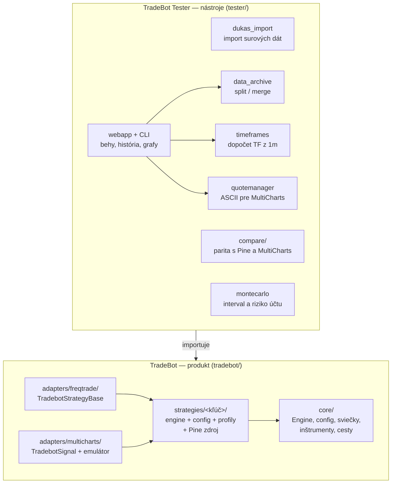
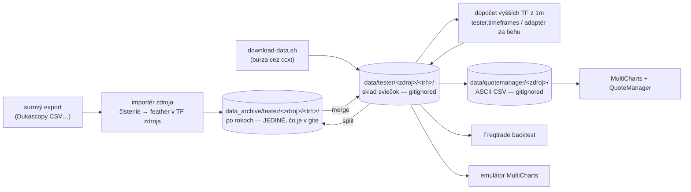
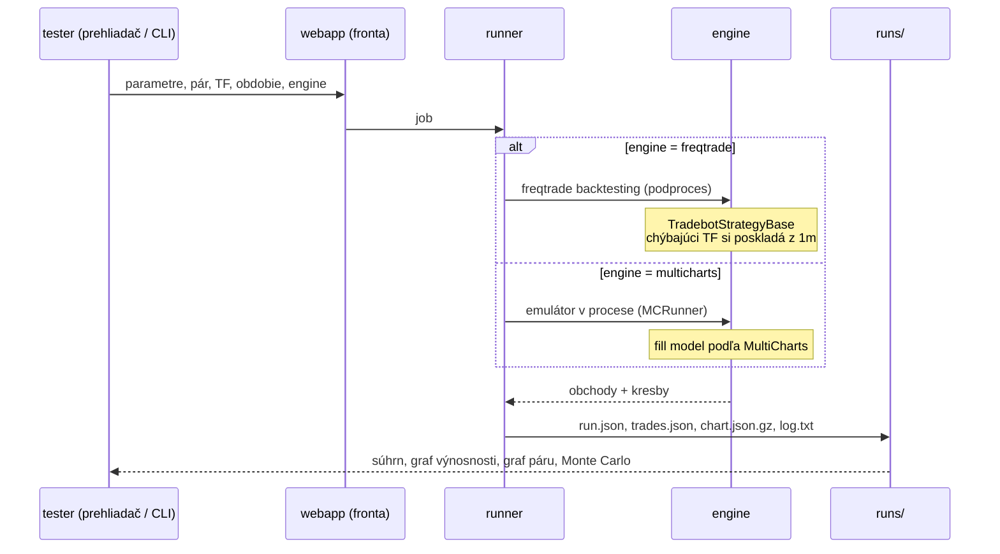

# Architektúra: čo je čím a ako tečú dáta

Prehľad celého repozitára na jednej strane. Detaily sú v odkazovaných dokumentoch —
[DATA.md](DATA.md) (dáta), [WEBAPP.md](WEBAPP.md) (Tester), [FREQTRADE.md](FREQTRADE.md),
[MULTICHARTS.md](MULTICHARTS.md), [ARCHITECTURE_port.md](ARCHITECTURE_port.md) (návrh portu).

## 1. Dva celky a smer závislosti

**TradeBot** je produkt, ktorý obchoduje. **TradeBot Tester** je to, čím sa produkt skúša.
Závislosť ide jedným smerom: Tester importuje `tradebot`, produkt o Testeri nevie.

Beh stratégie ide **cez jeden z dvoch enginov** a signály sú v oboch rovnaké; líši sa
model vyplnenia. Preto sa dá tá istá konfigurácia prehnať oboma a porovnať.

## 2. Cesta dát: od surového súboru po backtest

Jedno pravidlo drží celý strom: **do archívu ide len to, čo prišlo zo zdroja; všetko
ostatné je odvodené a do gitu nejde.**

* **Importér je jeden na zdroj** (dnes `tester.dukas_import`). Vždy: vyčistí surové dáta,
  spraví feather v tom timeframe, v akom zdroj je, rozdelí po rokoch, uloží do archívu.
* **Burzové dáta** sa sťahujú priamo do skladu a do archívu idú cez `split`.
* **`data/` sa nikdy necommituje.** Tester si ho pri prvom spustení vyrobí celý sám
  (merge + dopočet TF + export pre QuoteManager) — z prázdna 71 súborov za ~15 sekúnd.
* **Dopočítané sviečky sú evidované** (`data/tester/.derived.json`) a `split` ich preskočí,
  takže sa v archíve nemôžu zamiešať medzi skutočné dáta.

## 3. Beh backtestu

História behov (`tester/runs/`) a vlastné profily (`tester/profiles/`) sú **jediné dáta,
ktoré tester commituje** — tlačidlami Pull/Push alebo `python -m tester.webapp.cli push`.

## 4. Kde je čo rozhodnuté

| otázka | jediné miesto |
|---|---|
| cesty v repozitári | [`tradebot/core/paths.py`](../tradebot/core/paths.py) |
| skladanie vyššieho TF z 1m | [`tradebot/core/candles.py`](../tradebot/core/candles.py) |
| ktoré TF majú byť na disku | [`tester/timeframes.json`](../tester/timeframes.json) |
| kde ležia sviečky pre engine | [`tester/engines.py`](../tester/engines.py) |
| čo je dopočítané (a teda mimo gitu) | `data/tester/.derived.json` + [`tradebot/core/derived.py`](../tradebot/core/derived.py) |
| parametre stratégie | `tradebot/strategies/<kľúč>/config.py` + jej Pine zdroj |
| parita s TradingView | [`tester/tests/test_golden_tv_binance.py`](../tester/tests/test_golden_tv_binance.py) |

Pravidlo, ktoré z toho plynie: keď niečo počíta cesty, timeframy alebo sviečky na druhom
mieste, je to chyba — porovnanie platforiem prestane niečo znamenať.
